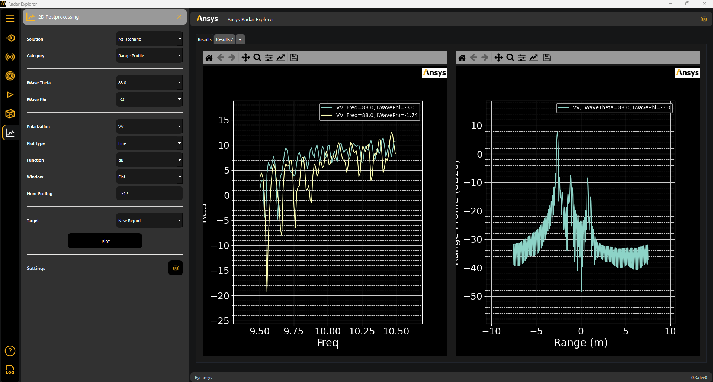
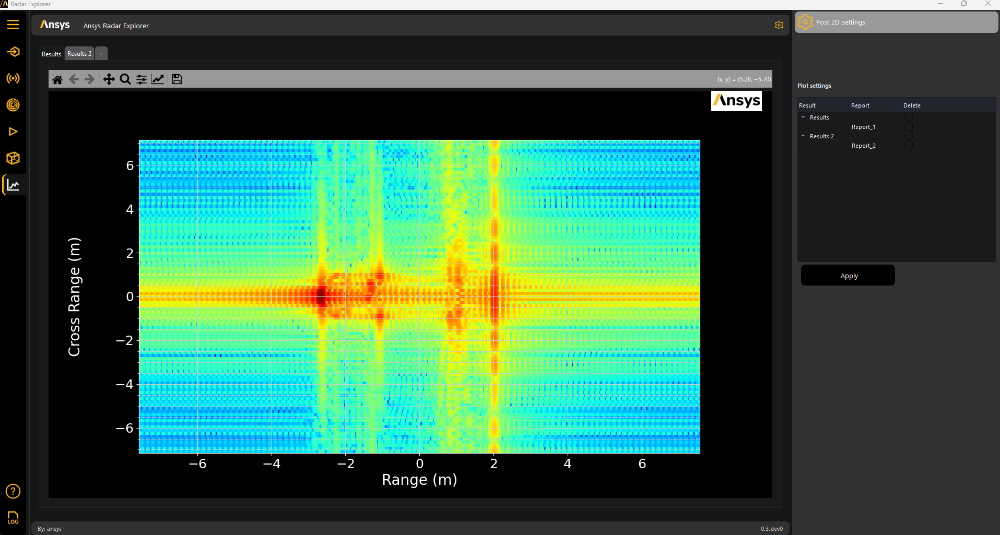

.. _post_2d:

2D Postprocessing
==================

The menu only displays the **2D Postprocessing** panel if the design is solved and results are extracted by the toolkit.

You have four 2D postprocessing categories:

* RCS
* Range profile
* Waterfall
* ISAR 2D

The **2D Postprocessing** panel lets you plot multiple plots in one single result tab, in the same tab, or even in the same plot.

.. image:: ../../_static/post_2d.png
  :width: 800
  :alt: 2D Postprocessing panel
  :align: center

.. note::
    You can access :ref:`2D settings <settings_2d>` to change the plot settings.

Clicking **Plot** generates 2D plots based on the specified settings.

.. _settings_2d:

2D settings
===========

#. Under **Settings**, click the gear icon to display the **Post 2D settings** panel for the generated plots:

.. image:: ../../_static/post_2d_settings.png
  :width: 800
  :alt: 2D generated plots
  :align: center

#. View, modify, and delete plots if necessary.

